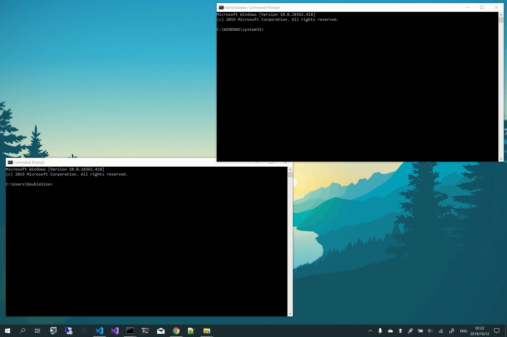

# Windows Sudo

A linux-like su/sudo on Windows. 

__这是一份样例工程。它可能存在安全漏洞，所以使用它自担风险。__

## 1. 如何编译？

```console
$ git clone https://github.com/DoubleLabyrinth/WindowsSudo.git
$ cd WindowsSudo
$ msbuild WindowsSudo.sln /p:Configuration=Release /p:Platform=x64  # or `x86` if you like
```

之后你会在 `bin/x64-Release` （或 `x86-Release`）下看到四个可执行文件：

```
su.exe
sudo.exe
WindowsSudo.Prompter.exe
WindowsSudo.Service.exe
```

## 2. 如何使用？

1. 将这4个可执行文件放到满足如下两个条件的目录下：

   1. 该目录在 `%PATH%` 环境变量中。

   2. 该目录只有管理员有可写权限。

   例如，你可以将这四个文件放到 `C:\Windows\System32\` 文件夹下。

2. 管理员运行 `cmd.exe` 来安装 `WindowsSudo.Service.exe` 为Windows服务。

   ```console
   $ cd C:\Windows\System32\
   $ WindowsSudo.Service.exe /install
   $ WindowsSudo.Service.exe /start
   ```

3. 享受 `su` 和 `sudo` 吧。

   __例如：__

   ```console
   $ sudo whoami /priv
   ```

## 3. 预览



